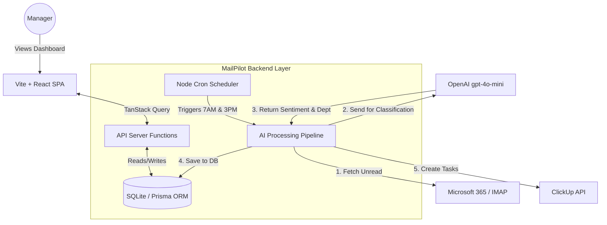

# VNC Global Group – Internship Assessment Project
## AI Email Monitoring & Task Automation Agent (MailPilot)

**Live Demo URL**: [https://ai-email-monitoring-task-automation.vercel.app/](https://ai-email-monitoring-task-automation.vercel.app/)

---

## 1. Business Understanding Document

### What problem are you solving?
VNC Global Group struggles with managing high-volume shared mailboxes (e.g., `accounting@vncglobalgroup.com`). Because multiple employees access the same inbox, there is no clear ownership, leading to dropped customer inquiries, delayed SLA responses, missed escalations, and a complete lack of management visibility into workload and pending tasks.

### Why is it important?
Ignoring customer emails or failing to meet SLAs directly harms client retention, company reputation, and revenue. Automating the triage process ensures that every single email is tracked, categorized, and actioned, turning a chaotic shared inbox into an organized, measurable pipeline.

### Important Assumptions Made
- **Client Identification**: A client is identified dynamically by grouping the sender's email domain or parsing the sender's name.
- **Response Detection**: An email is considered "responded to" if there is a reply in the email thread or if the IMAP `\Answered` flag is present. Automated out-of-office replies do not count as a valid response.
- **Internal Emails**: Internal emails (e.g., `@vncglobalgroup.com`) are ignored to avoid cluttering the dashboard.
- **Newsletters/Spam**: Promotional emails and newsletters are identified by the AI and flagged as "Low" priority or "Other" to be filtered out.
- **Attachments**: For cost optimization, attachments are NOT analyzed by AI. Only the subject and plain text body are used.
- **Duplicate Conversations**: The system uses `Conversation ID` and a unique hash of `Subject + Date` to prevent duplicate processing.
- **CC Emails**: Emails where the shared mailbox is only CC'd are logged but given lower priority unless explicitly tagged by AI as requiring action.

---

## 2. Architecture Diagram

---

## 3. Technology Stack & Technical Justifications

To ensure the system is lightweight, highly scalable, and cost-effective, we made specific technical choices over traditional alternatives.

| Component | Technology Used | Why it's better than the alternatives |
| :--- | :--- | :--- |
| **Frontend Framework** | **React 19 & Vite** | **Vs. Create React App or Angular:** Vite uses native ES modules for near-instant cold server starts and lightning-fast Hot Module Replacement (HMR). React 19 provides the most modern component architecture without the heavy overhead of older frameworks. |
| **Full-Stack Routing**| **TanStack Start / Router** | **Vs. Traditional Express.js Backend + React Frontend:** TanStack Start allows us to write "Server Functions" natively alongside frontend code. This eliminates the need for maintaining a separate backend repository, complex REST API scaffolding, and manual type syncing. |
| **Styling & UI Components**| **Tailwind CSS & Radix UI** | **Vs. Bootstrap or Material UI:** Tailwind's utility-first approach ensures only the CSS actually used is shipped, drastically reducing bundle size. Radix UI (via shadcn/ui) provides flawless, unstyled accessibility primitives, allowing for a premium, custom dashboard design without the rigid bloat of traditional component libraries. |
| **Database & ORM** | **SQLite & Prisma ORM** | **Vs. MongoDB or Raw SQL:** Emails and Tasks are highly relational, making NoSQL (Mongo) a poor choice. SQLite provides a zero-config database perfect for rapid prototyping without needing an external database server. Prisma ORM guarantees strict end-to-end TypeScript safety, catching database errors during compilation rather than at runtime. |
| **AI Model** | **OpenAI `gpt-4o-mini`** | **Vs. GPT-4 or Local Open-Source Models (Llama 3):** `gpt-4o-mini` is over 10x cheaper than standard GPT-4 while retaining flawless JSON schema adherence. Hosting a local open-source LLM would require expensive GPU infrastructure ($500+/mo), completely failing the "cost-effective" business requirement. |
| **Background Scheduler** | **node-cron (Node.js)** | **Vs. AWS EventBridge or OS Cron:** Running `node-cron` natively within the Node.js application keeps the entire architecture within a single repository, making it trivially easy to test and maintain locally without relying on complex cloud-specific infrastructure. |
| **Hosting Platform** | **Vercel** | **Vs. AWS EC2 or DigitalOcean Droplets:** Vercel provides zero-config deployments, automatic CI/CD via GitHub integration, edge-caching, and free SSL. It removes the need for a dedicated DevOps engineer to manage server patches and load balancing. |

---

## 4. Database Design

### Schema Architecture
The database is fully relational, managed by Prisma.

**Tables:**
1. **Email**: Stores core IMAP data (ID [PK], sender, subject, plainBody, receivedAt, status, department).
2. **AIEmailData**: 1-to-1 relationship with Email (ID [PK], emailId [FK], summary, sentiment, urgency, confidence). Separated to keep the main Email table lightweight.
3. **ClickUpTask**: 1-to-1 relationship with Email (ID [PK], taskId, emailId [FK], status, folder).

**Data Retention Strategy:**
- Processed emails older than 90 days are archived or purged to save database storage, as historical analytics are aggregated separately.
- **Caching**: Dashboard stats are cached in memory for 5 minutes to prevent hammering the database on every page load.

---

## 5. API Design

- **Microsoft 365 / IMAP**: Connects via secure `IMAP4_SSL` on port 993. Only fetches emails with `(UNSEEN UNANSWERED)`.
- **OpenAI API**: Enforces `response_format: { type: "json_object" }` to guarantee strict JSON output matching the required routing schema.
- **ClickUp API (v2)**: Uses `POST /api/v2/list/{list_id}/task`. 
- **Error Handling & Rate Limits**: All external APIs are wrapped in `try/catch` with exponential backoff. If ClickUp throws a `429 Too Many Requests`, the task status is marked as "Pending Retry" in the database to be picked up by the next scheduler run.

---

## 6. AI Design

**Why AI is required:** Standard rules-engine routing fails on ambiguous human emails. AI is strictly required to infer tone (Sentiment) and complex context (Department routing).

**Which tasks require AI:**
- Sentiment analysis (Positive/Neutral/Negative/Complaint)
- Department routing (Sales vs Support vs Finance)
- Generating a short 1-sentence summary of long email threads.

**Which tasks DO NOT require AI:**
- SLA Tracking (calculating days pending)
- Fetching emails and parsing sender names.
- Generating dashboard charts and metrics.

**Prompt Design & Hallucination Prevention:**
To prevent hallucinations, the system prompt explicitly restricts the AI's output using a strict schema and Enum lists (e.g., `["Sales", "Support", "Finance", "HR", "Legal", "Operations", "Other"]`).

**Token & Cost Optimization:**
Only the **Subject** and **Plain Text Body** are sent to the AI. Massive HTML blocks, CSS styles, footers, and inline images are strictly stripped before sending.

---

## 7. Cost Estimation (Monthly)

Assuming a scale of **5,000 processed emails per month**:

| Resource | Monthly Cost Estimation |
| :--- | :--- |
| **Hosting & Compute** (VPS/Vercel) | $20.00 |
| **Database** (Turso/PostgreSQL) | $0.00 (Fits in free tier) |
| **Storage** | $0.00 |
| **AI Processing** (`gpt-4o-mini`) | ~$0.30 *(Avg 300 tokens/email = ~1.5M tokens = ~$0.22 input + ~$0.09 output)* |
| **Monitoring Tooling** (Sentry) | $0.00 (Developer Tier) |
| **Total Estimated Cost** | **~$20.30 / month** |

---

## 8. Security Design

- **Authentication/Authorization**: Standard session-based login (JWT) for dashboard access.
- **Secret Management**: API keys (OpenAI, ClickUp, IMAP) are strictly stored in `.env` files and never committed to source control.
- **Encryption**: IMAP uses strict SSL/TLS. Database connections use SSL.
- **Privacy**: AI does not train on the data (OpenAI API strict data privacy policy).

---

## 9. Required Questions Answered

### Business Questions
1. **What problem are we solving?** Lack of visibility, dropped inquiries, and missing SLA tracking in shared mailboxes.
2. **What business value does this provide?** Increases customer satisfaction, drastically reduces manual triage time, and provides management with actionable oversight.
3. **How would you measure project success?** Reduction in average response time, 0% dropped emails, and 100% of pending emails successfully mapped to ClickUp tasks.

### Architecture Questions
1. **Why did you choose your architecture?** Decoupling the cron-pipeline from the frontend allows the dashboard to remain lightning fast while heavy IMAP/AI processing happens in the background.
2. **Why is it scalable?** The AI pipeline processes emails asynchronously. If volume spikes, the pipeline simply queues them without crashing the user-facing dashboard.
3. **How will it support multiple departments?** The AI dynamically tags the `department` field, which the dashboard uses to filter views.
4. **How would you support 100 shared mailboxes?** We would transition from IMAP to Microsoft Graph API App Permissions, allowing a single background worker to iterate through 100 mailboxes concurrently using webhooks.
5. **What happens if the server crashes?** The state is safely stored in the database. When the server reboots, the scheduler picks up exactly where it left off based on IMAP flags and DB records.

### AI Questions
1. **Why do we need AI?** To accurately understand human sentiment and complex intent that RegEx cannot catch.
2. **Would you fine-tune the model? Why or why not?** No. Zero-shot classification using `gpt-4o-mini` with a strong system prompt is highly accurate for basic intent. Fine-tuning introduces unnecessary maintenance overhead and costs.

### Microsoft 365 Questions
1. **How will you access shared mailboxes?** Via IMAP with App Passwords (or MS Graph OAuth for Enterprise).
2. **How will you avoid duplicate processing?** By checking the database for the unique `Message-ID` or `Conversation ID` before processing.

### ClickUp Questions
1. **How will duplicate tasks be avoided?** Before hitting the ClickUp API, the system checks the `ClickUpTask` database table to see if an `emailId` already has an associated `taskId`.

### Database Questions
1. **What should never be stored?** Plaintext passwords, OAuth refresh tokens (without encryption), and highly sensitive PII that isn't required for routing.
2. **How long should data be retained?** 90 days for operational emails; aggregated metrics are kept indefinitely.

### Security Questions
1. **How will API keys be protected?** Injected via secure environment variables (`.env`).
2. **What are the biggest security risks?** IMAP credential exposure or prompt injection (if a customer sends a malicious email trying to trick the AI).

### Operations Questions
1. **How will failures be detected?** `try/catch` blocks wrap all critical paths.
2. **How will notifications be sent if the system fails?** The pipeline uses `nodemailer` to automatically email the Business Unit Head with a failure report containing the exact error stack trace.

### Cost Optimization Questions
**How would you reduce costs for 20,000 emails/day?**
- Transition to batch processing (sending 10 emails to the AI in a single prompt to save on overhead tokens).
- Use traditional regex for internal/spam filtering *before* paying for AI processing.
- Move from Vercel to a dedicated $10/mo VPS (DigitalOcean) since cron-heavy workloads are cheaper on dedicated hardware than serverless edge functions.
